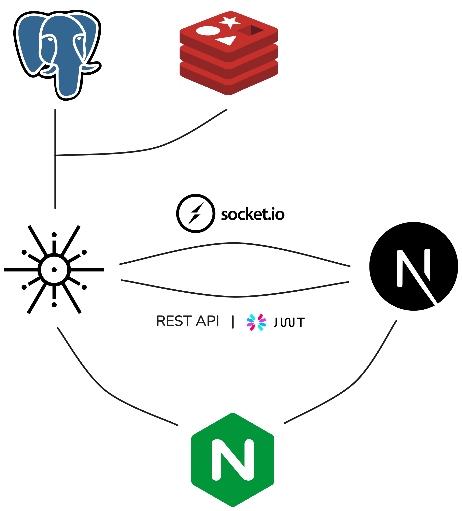

# Plainchat

Minimalist realtime chat app

## Table of Contents
- [Plainchat](#plainchat)
    - [TL;DR](#tldr)
    - [About](#about)
    - [Technologies used](#technologies-used)
    - [Project structure](#project-structure)
    - [Project architecture](#project-architecture)
    - [Installation](#installation)
        - [With docker](#with-docker)
        - [Without docker](#without-docker)
    - [Screenshots](#screenshots)
    - [Contributions](#contributions)

## TL;DR

* :speech_balloon: Plainchat is a realtime chat app built with Axum (backend) and Next (frontend)
* :rocket: Blazingly fast
* :lock: Secure chats using JWT authentication
* :sparkles: A minimal yet elegant UI

## About

Plainchat is a realtime chat app built with speed and security in mind. It's backend is built with rust, and uses redis for caching to ensure a smooth experience.


## Project Architecture

The following diagram mostly explains the main architecture of the app and relations between services: 



## Technologies used

|Technology/Framework|Utility                     |Version|
|--------------------|----------------------------|-------|
|Rust                |Programming language        |1.80.1 |
|axum                |Backend Rust server         |0.7.5 |
|Next                |Frontend server             |14.2.5|
|React               |Frontend framework          |18.X |
|Tailwind            |Stylesheets                 |3.X    |
|Socket IO           |Websocket library           | 4.7.X | 
|nginx               |Reverse proxy server        |1.27.0 |
|Postgres            |SQL engine                  |16.X |
|Redis               |Messaging and cache         |7.4.0 |

## Project structure

```
.
├── Cargo.lock => Dependency lock file generated by Cargo
├── Cargo.toml => Main configuration file for the Rust project
├── docker-compose.yml => Docker compose file
├── LICENSE.MD => License file for the project
├── README.md => Project README file
├── imgs => README images
├── .example.env => Example env file
├── plainchat-server => Rust crate for the backend service
├── plainchat-client => Next app for the frontend service
├── nginx => Config files for nginx server
```

## Installation

#### With Docker:

The application can be built simply by using docker, either use the provided sample .env file in the project root or configurate it (and docker-compose accordingly), then prepare sqlx compile checks with:
``` 
cargo sqlx prepare
```
Finally, run the app with: 
```
docker-compose up --build 
```
And access it in your browser within `http:localhost`.

#### Without Docker: 

First start Redis (`redis-server`), Nginx, and Postgres DB on your PC.  
Unlike the default, place the .env file in the plainchat-server directory, configurate your postgres DB with `sqlx database create` and apply the migration with `sqlx migrate run`, prepare sqlx with `cargo sqlx prepare`, then finally run `cargo run`.  
Run the Next frontend with `pnpm dev`. Modify port in `@/app/lib/globals.ts` to 5000. Access the app within `http://localhost:3000`.

## Screenshots


## Contributions

Feel free to open a PR, adding new features or bugs fixes are much appreciated.
